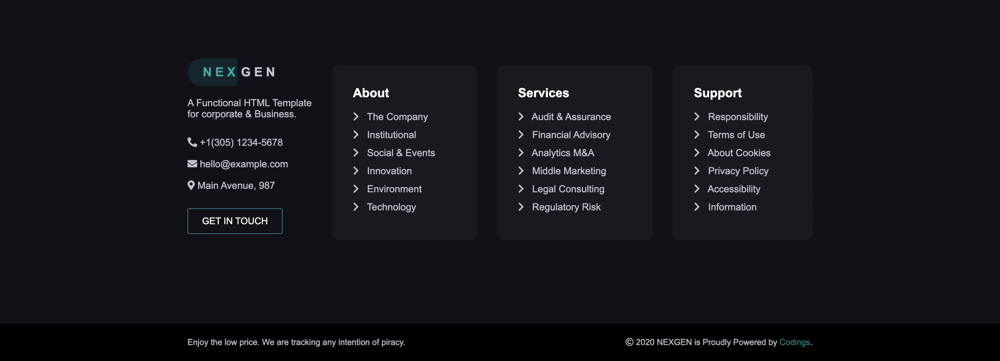

# NEXGEN
NEXGEN is an HTML & CSS template for insurance-consulting companies.

This replica, instead, has been made with HTML, SASS & VueJS.

## Header
The header contains some useful links and information, with a form that can be filled to get in touch with the company.  
Every link is populated through the use of VueJS, every object has a 'name' & 'url' property.

## Main
The main section is divided in 6 different sections regarding every peculiarity of the company.

### About The Network

### Our Business Areas

### How it works in practice

### What we like to do

### Our Editorial Content

### Newsletter

## Footer
The footer is very similar to the header, containing links and information about the company, links are still populated with VueJS.

